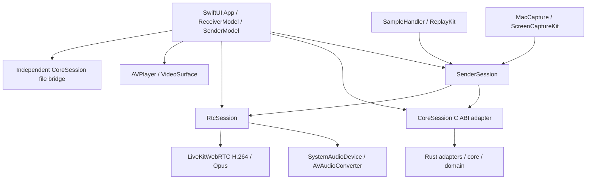

# 11 苹果客户端架构与验收（D09）

日期：2026-10-04。根据新增的苹果发送／接收需求，替代旧规划中“Mac/tvOS 不进入 1.x、iOS 等待 v1.2”的范围约定。本文记录实际实现与平台约束；最终构建证据统一在 08，不将源码存在视为真机验收。

## 产品与入口

| 目标 | 最低版本 | 实现入口 | 功能 |
|---|---|---|---|
| LanCastMac | macOS 13 | SwiftUI + ScreenCaptureKit | 窗口／显示器及系统声音发送、MP4 发送、自有镜像与文件接收 |
| LanCastIOS | iOS/iPadOS 16 | SwiftUI + ReplayKit Broadcast Upload Extension | 系统广播及应用声音发送、前台 MP4 发送、前台接收 |
| LanCastTV | tvOS 17 | SwiftUI + Metal/AVPlayer | 自有镜像与 MP4 接收、遥控确认与停止 |

采用 LanCast 自有 WSS/WebRTC 协议。Apple TV 内容 App、AirPlay、DLNA 是不同产品或协议；本实现不冒充 AirPlay，也没有把 Apple 端 DLNA 直播标为已完成。Windows/Android 原有 DLNA 模块仍独立。

## 模块和所有权



- `Contracts` 是仅依赖 Foundation 的 Swift Package：会话代次、一次配置格式、完整指纹校验、120 秒有效期与时钟回退拒绝。可单独 `swift test`。
- `CoreSession` 是唯一直接触碰 Rust C ABI 的 Swift 文件。命令、poll/free、shutdown/destroy 使用同一个串行队列；关闭后拒绝事件交付，阻塞销毁不发生在 UI 线程。
- `SenderSession` 组合配对、请求 ID、媒体协商和文件资源。迟到的 accepted/SDP/ICE 通过会话与代次过滤。关闭控制连接撤销远端会话，不依赖已经取消的命令队列补发 Stop。
- `RtcSession` 不引用 UI 或控制核心。SDP/ICE/释放只在媒体串行队列；H.264 factory 限制协商，视频最多两个待处理样本，音频转换队列最多四个样本。连接或首帧超时明确失败；统计是独立回调，不注入协议不支持的发送端消息。
- `SystemAudioDevice` 将系统 PCM 转成 48 kHz、16 bit、双声道交错数据，同一工作线程交给 WebRTC。没有麦克风输入，不把系统禁采静音替换成麦克风。关闭时通知并等待线程，解除 delegate 引用。
- `ReceiverModel` 管理播放组合。文件使用独立 Rust loopback 桥：仅对固定上游 HTTPS 完整 SPKI 校验，对 AVPlayer 暴露带 token 的 127.0.0.1 HTTP；停止、换会话或断开时销毁桥，不关闭证书校验。Metal renderer 在视图拆卸时解除绑定。
- Mac 主应用和 iOS 扩展分别持有采集资源；App Group 只传一次性配对配置，不传像素，不保存永久信任。扩展原子领取并删除配置，忽略 `.audioMic`，主应用进入后台不接管扩展。广播暂停后结束，会话恢复需再次明确启动。

控制 JSON 仍局限在适配与组合边界，并非所有平台流程都已归入 Rust Coordinator。`LKRTCVideoTrack` 只在苹果内部媒体显示适配使用，不属于公开跨平台 ABI。未来替换 RTC 或播放器应保留这些边界，再扩展契约和回归测试。

## 构建、安装与依赖

在装有完整 Xcode 的 Mac 上运行：

```sh
python3 scripts/build-apple.py --platform macos
python3 scripts/build-apple.py --platform ios
python3 scripts/build-apple.py --platform tvos
```

三个平台可在独立检出目录并行构建；脚本共享 `apple/Dependencies`，同一工作区应顺序执行。切换平台会重新生成该平台的 Rust XCFramework。Mac 包含 ARM64/x86_64 静态库；iOS 包含 ARM64 设备和模拟器切片；tvOS 包含 ARM64 设备与模拟器切片。tvOS 的 Rust 构建只启用接收所需 `legacy` 媒体桥，禁用 `sender`。

`apple/project.yml` 是工程源；XcodeGen 2.44.1 和 LiveKitWebRTC 150.7871.02 的下载 SHA-256 固定在脚本。Rust 使用 1.98.1 和 Cargo.lock。LiveKitWebRTC 是免费开源 WebRTC 二进制，不需 LiveKit 云服务、API Key、STUN/TURN 账户或付费投屏 SDK；它并非本仓库已复现的裁剪源码构建。

Apple Actions 构建设备与模拟器目标，Mac 运行契约、配对、TLS 错误指纹、H.264 回环和音频转换测试；归档 zip、xcresult、工具链／依赖／产物哈希报告及许可。Xcode runner 镜像可能更新，实际 Xcode 版本必须读 build-report.json，不能宣称全部工具链位级可复现。

设备 zip 不是已签名 IPA 或商店发行包。安装需要开发者自行配置 bundle IDs、团队、设备签名，以及主应用和广播扩展一致的 App Group 与 `LanCastAppGroup`。账户是否支持所需 capability 按 Apple 当前规则处理。macOS 测试使用 ad-hoc 签名；正式发布另需适用签名和公证。CI 不使用开发者私钥。

## 操作

接收端启动后显示 LAN 地址、完整 SHA-256 与一次邀请。发送端扫描只取得地址，仍须核对指纹、填入邀请并在接收端批准。Mac 先选择明确来源再开始分享；窗口画面可伴随系统全局声音。iOS 先准备广播，再点击系统广播控件；通过系统录屏指示器停止。接收端前台可停止会话；进入后台结束接收。

MP4 通过文件选择器获得授权；发送端保持前台及文件访问授权，可播放／暂停／跳转／调整音量。文件从已配对设备的固定 HTTPS 服务读取，不上传到云端。每次新连接需刷新邀请；失联明确结束，不自动重新录屏。

## 验收边界

自动化检查覆盖合成输入与本机回环，不能代表 ScreenCaptureKit 权限、ReplayKit 扩展内存限制、扬声器可听声音或跨 Wi-Fi 性能已验收。首帧事件表示解码器交付视频帧，不是物理屏幕的延迟测量。

必须补充的真机记录：Mac Intel/Apple Silicon；iPhone/iPad 广播前后台、旋转、暂停、系统撤销和受保护内容；Apple TV 遥控焦点、配对与扬声器；Windows/Android→Apple 和 Apple→Android；断网后重新授权、重复文件播放与 seek；两小时稳定性、RSS、实际音画同步。完整 ICE 恢复、Android 定制 WebRTC、签名发行和二进制 SBOM 仍列为项目剩余工作。
