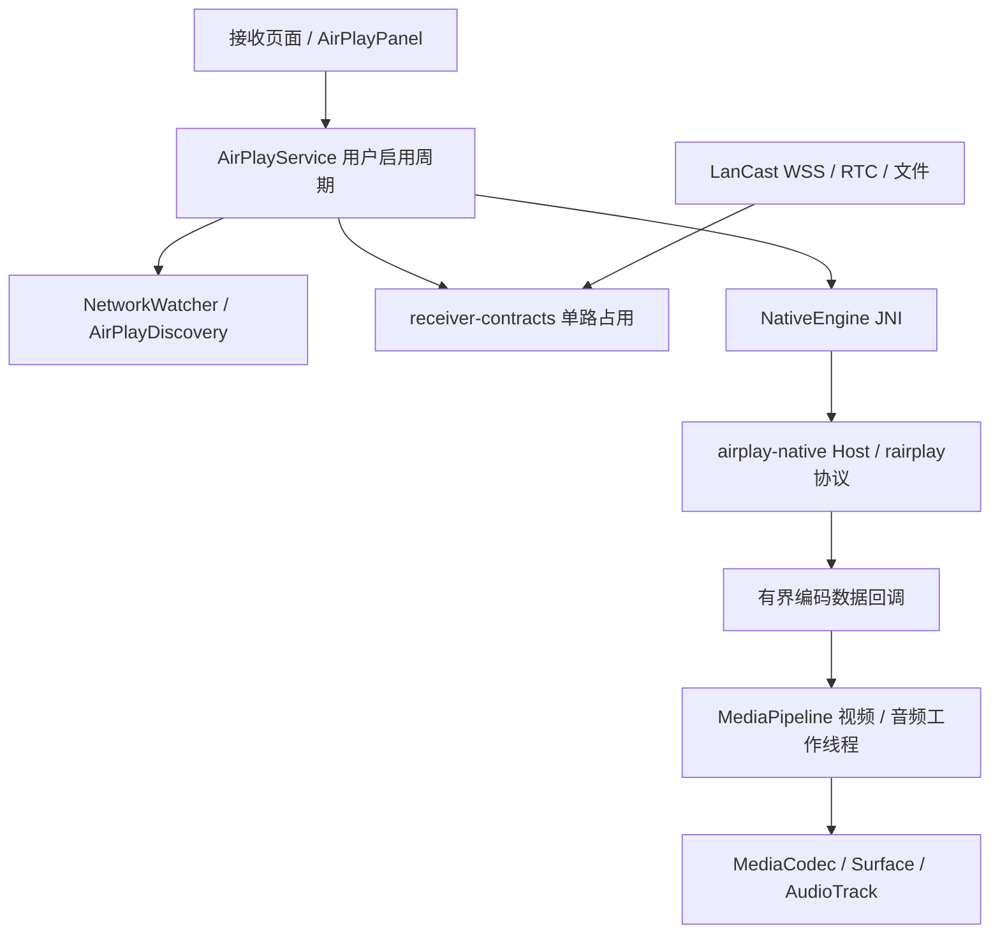

# 20 AirPlay实现与审阅指南

日期：2026-10-08；开发版本：0.6.0 / 8；D15实施记录。

本轮将按需AirPlay接收落实到独立Android产品变体。代码包含现代HomeKit配对与加密控制、旧镜像配对、媒体接收、Android解码播放、手动开关、后台等待和单路仲裁。**现代AP2和legacy在真实iPhone/电视上的互通尚待验证，不能据源码或CI称为已通过完整AirPlay 2验收。** 后续构建与测试证据在08与validation目录维护。

## 安装与操作

GitHub Android工作流生成四个APK：Sender、Receiver Standard、Receiver Legacy、Receiver Airplay。需要苹果原生投屏时选择`airplay`接收APK，最低Android API23；现有Standard API23和Legacy API21要求不变。Airplay包采用独立应用ID，可与原接收端分别安装。

打开接收App，手动勾选“允许苹果系统屏幕镜像”。服务就绪后，在iPhone/iPad控制中心选择接收名称；系统要求配对时输入接收页的苹果配对码，随后在电视允许连接。LanCast自有8位码与苹果配对码是不同认证入口。界面显示“正在接收”以解码器实际渲染回调为依据。

Home回到桌面后继续监听；后台收到请求时通知用户返回接收页确认，最多等待15秒。无显示Surface不接纳画面；播放中离开接收页结束该次媒体会话，保持监听。关闭开关、通知中的关闭、返回退出或移除任务停止服务。服务不注册开机广播，使用`START_NOT_STICKY`，系统重建不会自动开启。

## 模块边界

`receiver-contracts`是纯Kotlin域契约，不依赖Android或网络。待确认与播放共用同一租约，释放核对持有者及代次。AirPlay服务独立管理启用代次与每次引擎代次，旧发现/媒体回调不能影响新会话。协议实现、JNI和Android播放器不依赖现有Rust控制核心，逐帧数据不经过控制JSON。

## 协议选择与能力

选择经过修正的`rairplay`固定快照，保留原作者与PlayFair来源/许可证；以一个引擎发布一组接收身份，公告现代HomeKit配对与旧镜像兼容。每条TCP连接按实际握手格式锁定一种模式，认证失败不换协议、不降低认证。UxPlay继续作为协议/Android接入对照，没有打包第二个竞争服务。

提供H.264屏幕镜像、AAC-LC/AAC-ELD与16位双声道PCM的实时音频接入；AAC不同profile分别检查。只公告有实现的功能，明确拒绝HEVC、PTP、type103缓冲音频、ALAC、HLS及多房间。现代AP2的产品验收仍须验证客户端确实选择了对应配对、加密控制及媒体路径，不能只看设备列表的名称。

NTP通道使用四时间戳估算偏差，RTP同步报文建立音频采样时钟与协议时间的映射；没有有效校时不以到包时间代替播放时间。媒体队列按帧数、字节及时间跨度限制，超限结束会话；视频配置变化受控重建解码器。实际可听同步、丢包恢复和性能需要设备实测。

## 与上游相比的必要修正

- 旧配对使用真实私钥签名，公开密钥不再作为私钥种子；第二阶段签名失败返回认证失败，未验证前不安装会话密钥。
- RTSP按完整报文增量处理，保留后续流水请求；限制头部、正文和连接数，拒绝歧义Content-Length。控制连接可取消并有空闲超时。
- FairPlay请求长度/模式、视频帧长度与音频包长度受限；解密/完整性失败的包不交付播放器。原生诊断不记录密钥、PIN或屏幕字节。
- Android宿主授权先于媒体SETUP，服务关闭等待原生线程和播放线程结束后释放资源。
- 发现信息、音频profile与实际播放器范围一致；不继承上游默认的HLS/图片/PTP/缓冲音频功能公告。

## 构建和分发

`airplay-native`使用独立Cargo.lock，`scripts/build-android-airplay.py`编译ARM32/ARM64 JNI，GitHub Actions运行本地协议测试及Android构建/lint/纯Kotlin契约测试。安装包校验检查两种ABI、ARM64 16KB对齐，以及AirPlay库是否只进入Airplay变体。

基础源码继续Apache-2.0；AirPlay协议、适配模块及包含它的组合APK按GPL-3.0-only分发。关闭运行开关不会改变许可证义务。工作流保存对应LanCast源码、原始上游哈希、修改后源码、Cargo依赖源码、清单和重建说明。现有WebRTC AAR仍属于固定供方二进制，其完全可复现来源和正式发行审计沿用原项目未完成项；不把本轮开发产物称为发行审计已通过。

## 审阅及验收

1. 先检查`receiver-contracts`与双入口租约，再检查Service启用/停止/网络变化与Surface生命周期。
2. 检查native身份签名、配对路径锁定、所有媒体入口的授权与边界检查。
3. 对照`UPSTREAM.json`审阅fork修正，运行协议测试，核对GitHub实际构建SHA。
4. 分别实测现代AP2与legacy：PIN正确/错误、允许/拒绝、真实画面和声音、旋转、后台请求、网络切换、反复开关、双方抢占、长时间播放。
5. 记录设备型号、系统版本、实际握手模式和失败阶段；无真机证据保持“待验收”。
